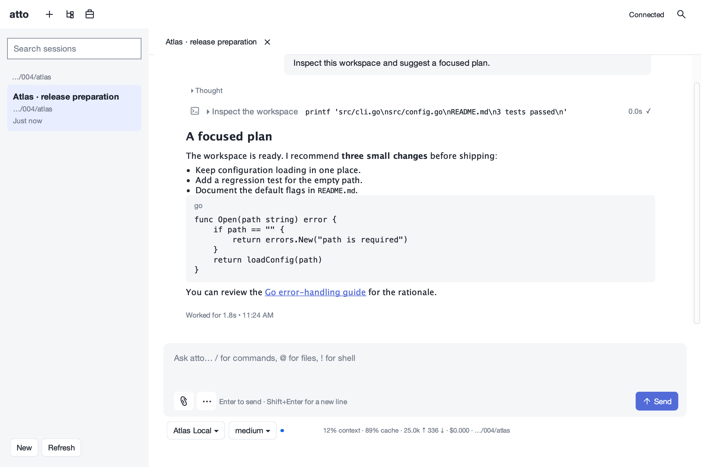
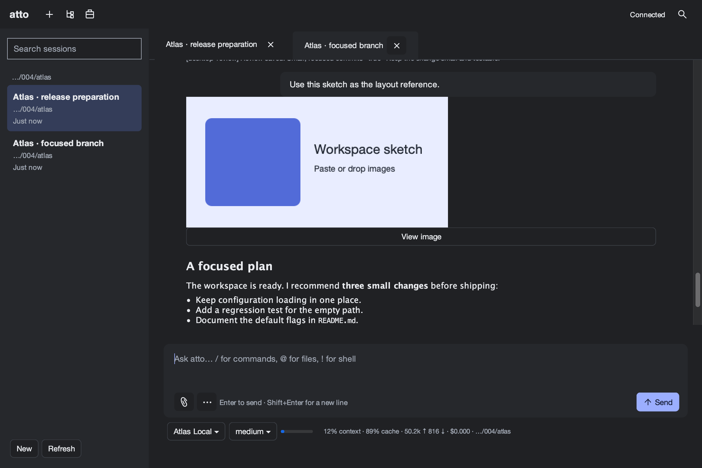

# atto Swing desktop

A Java 21 desktop client for **atto's native app-server protocol**, not a Codex
wire adapter. The JDK is the only Java dependency: no Maven, Gradle, downloaded
libraries, embedded web view, or frontend execution engine.

## Build and run

```sh
clients/swing/build.sh
java -jar clients/swing/build/atto-swing.jar

# An explicit binary and workspace; default transport is JSON lines on stdio.
java -jar clients/swing/build/atto-swing.jar --atto /path/to/atto --cwd /work/project

# Join a saved session, or open more sessions using the sidebar.
java -jar clients/swing/build/atto-swing.jar --atto /path/to/atto 1234abcd

# Connect to an existing listener. Nothing is spawned in this mode.
atto app-server --listen ws://127.0.0.1:7878
java -jar clients/swing/build/atto-swing.jar --connect ws://127.0.0.1:7878

# atto serve requires its token; use its /ws endpoint.
java -jar clients/swing/build/atto-swing.jar --connect ws://host:7878/ws --token TOKEN

atto app-server --listen unix:///tmp/atto.sock
java -jar clients/swing/build/atto-swing.jar --connect unix:///tmp/atto.sock
```

`atto` is found on PATH unless `--atto PATH` is supplied. `--in-process` passes
that flag to a spawned app-server (useful without a daemon); it is not a Java
execution mode. `--cwd DIR` is the subprocess's initial working directory and
the initial new session's workspace. A new session dialog accepts a directory
**on the server**, which need not be a path accessible to the desktop.

No-argument launches remember the last endpoint and binary. An explicit
`--atto atto` selects stdio again. Tokens, URL queries, fragments and URL user
credentials are **never saved**; provide `--token` again for an authenticated
endpoint. Layout, theme and transcript/composer font size are saved only in
`~/.atto/swing.json`, never in atto's runtime settings. `"sound":true` in that
client file enables the optional unfocused-window notification sound.

On Windows, `build.sh` can run in Git Bash with JDK 21 on PATH. Unix listeners
are skipped by the Windows integration test. WebSocket (`ws://` and `wss://`)
and stdio use JDK facilities on every platform.

## Daily work

- Searchable session sidebar with names, cwd, timestamps and live/busy state;
  several independent session tabs. New, resume, rename, fork, archive, detach
  and explicit close are available from the Session menu or command palette.
- Transcript rows update in place, batching streams at 20fps. Initially only
  the latest 200 items have Swing components; **Load earlier messages** adds
  another page. User scrolling stops following; **Jump to bottom** resumes it.
- Assistant Markdown supports headings, lists, quotes, inline code/emphasis,
  links and fenced code with copy buttons. Reasoning is collapsed. Commands
  show command, status, duration, exit/background details and a clipped output
  tail, with expansion and a full available-output viewer. Notices, compactions,
  goals, branch summaries and extension text/display replacements are preserved.
  `/diff`'s extension text and diff code blocks have colored additions/deletions.
- Native user/tool images show PNG thumbnails (including server-side WebP
  conversion) and an image viewer with **Save original**. Attach files, drop
  files/images onto the composer, paste an image, or use the attachment action.
- Pending steer/queue items appear above the composer, with **Edit / take back**
  and **Remove**. Images recovered by the runtime belong to the originating
  client rather than being inserted into every editor.
- Runtime prompts are non-modal and first-answer-wins. Select, confirm, input
  and multi-select are supported; a peer's answer withdraws the dialog. Local
  pickers use balanced runtime gates so automatic queue/goal work waits.
- Filterable model/provider/context-window picker and effort picker; provider
  authentication status, masked API-key entry and browser OAuth with redirect
  paste. Credentials are stored by the **server**, not the desktop.
- Session tree with jump, labels, optional automatic/custom branch summaries,
  and fork; a saved transcript message also has a fork/label context menu.
- Goal objective/state/usage/notes, background-job list/output follow/stop,
  timers, observational agents, context/system breakdown, compaction/reload,
  request export, server heap/goroutine/memory/request-history diagnostics and
  usage totals. These all use native RPCs, not shell substitutes.
- Built-in status shows model/effort, context usage, cache percentage, in/out
  tokens, cost, activity/elapsed time, jobs/timers and cwd. Configured custom
  statusLine output plus extension statuses/widgets have additional rows.
  An unfocused window gets a title badge and OS attention on turn completion
  or a waiting prompt.

Every runtime slash command (including registered extension and skill commands)
is submitted as typed. Client-local commands open desktop controls: `/model`,
`/effort`, `/copy`, `/context`, `/goal`, `/tree`, `/fork`, `/resume`, `/sessions`,
`/jobs`, `/timers`, `/agents`, `/name`, `/archive`, `/clear`, `/new`, `/request`,
`/debug`, `/login`, `/logout`, `/detach`, `/close`, `/quit` and `/exit`.
`/goal set OBJECTIVE` is also accepted; `/goal OBJECTIVE` is the native spelling.
Slash completion uses the live command catalog, and `@file` completion uses
server workspace discovery, including remote workspaces. Ctrl+Space or the
**Complete** button opens completion for the current prefix.

Terminal-only `/tui` renderer modes and `/remote` listener/QR management do not
apply to Swing: they explain the desktop theme controls and listener setup
rather than pretending to execute those TUI-owned actions. Run app-server or
serve with a listener to attach other clients to the same daemon session.

## Keyboard

“Cmd/Ctrl” means Command on macOS and Control elsewhere. Every menu action and
slash command is also reachable through the searchable command palette.

| Shortcut | Action |
| --- | --- |
| Enter | Send; steer while a model turn is busy |
| Shift+Enter | Newline |
| Tab or Cmd/Ctrl+Q | Queue composer input |
| Cmd/Ctrl+Enter | Interrupt and send now |
| Shift+Left / Alt+Up | Take back the last pending steer, otherwise queue item |
| Esc | User interrupt; a hosted running command becomes a background job |
| Cmd/Ctrl+B | Background the current command |
| Cmd/Ctrl+K | Command palette |
| Ctrl+Space | Complete slash command / @file prefix |
| Cmd/Ctrl+N / O | New / resume session |
| Cmd/Ctrl+W | Detach selected tab |
| Cmd/Ctrl+Shift+W | Close session and stop its work (confirmation) |
| Cmd/Ctrl+[ / ] | Previous / next session tab |
| Cmd/Ctrl+M / E | Model / effort |
| Cmd/Ctrl+T / J / G / I | Tree / jobs / goal / context |
| Cmd/Ctrl+Shift+T / A | Timers / agents |
| Cmd/Ctrl+Shift+C | Copy last answer |
| Cmd/Ctrl+U / Shift+V | Attach / paste image |
| Cmd/Ctrl+L / End | Focus composer / jump to bottom |
| Cmd/Ctrl++ / - | Transcript/composer font size |
| Ctrl+Tab | Move focus out of the composer |

Hard cancel, reload, compact, diagnostics, authentication and remaining actions
are in the palette. Picker Enter selects; Escape closes; lists and trees support
normal Swing keyboard navigation.

## Lifetime, trust and reconnect

Closing a tab/window **detaches**, rather than sending thread/close. Daemon
workers keep executing without the desktop. **Close session** and `/close`
explicitly stop a session and its jobs; archive closes before moving the saved
file. With `--in-process`, ending the spawned **server process** necessarily
ends its runtimes; it cannot provide daemon-backed unattended lifetime.

The desktop defers new/resumed startup, lists configured hooks, extensions and
MCP servers, and asks before releasing startup work. **Allow once** releases
this session; **Allow** remembers this startup review in the client settings
until its loaded executable configuration changes. Neither button overrides
native project-content approvals: unapproved content stays disabled and can be
approved with `atto trust` on the server. Runtime extension/MCP approvals remain native
questions; disconnect never supplies an approval automatically. A session whose
legacy writer is elsewhere is read from disk and shown read-only, not taken over.

Disconnect fails pending requests, retries after two seconds, initializes again,
and rehydrates attached sessions from fresh snapshots. Notification cursors and
item IDs prevent double-appended text. **Accepted inputs are never automatically
resent**: a lost reply does not establish that the server rejected the input.
Inspect the transcript before resending a recovered draft. Reconnect and explicit
session resume work over all three transports.

Use bearer-authenticated TLS/private-network endpoints for remote access. Plain
WS has no transport encryption. Runtime requests, exported profiles and saved
outputs may contain private workspace/provider data; choose export locations
accordingly. Raw Markdown HTML and arbitrary remote images are not executed or
fetched. Native transcript image resources are separate from Markdown links.

## Reproducible GUI review





These are real Swing component captures, not browser mock-ups. They were
captured and visually reviewed on macOS using the real native server with a
local scripted provider; no paid model or personal credentials are involved.
The images are 2× resolution PNGs (typically 90–190 KiB).

```sh
# Requires a desktop/display server and Java 21. CI remains headless by default.
ATTO_SWING_SCREENSHOTS=1 go test ./clients/swing -run TestSwingScreenshots -count=1 -v

# Or drive any disposable server/workspace with your own JSON action script:
java -jar clients/swing/build/atto-swing.jar --atto /path/to/atto \
  --in-process --cwd /tmp/work --screenshot-script /path/to/actions.json
```

The fixture in `swing_test.go` provisions an isolated ATTO_DIR and Java home,
installs the local streaming model and a prompt extension, and runs
[`docs/screenshot-script.json`](docs/screenshot-script.json). It verifies real
composer actions, queue takeback, completion, context-menu forking, model/effort
pickers, goals, jobs/follow/stop, extension select/confirm/input answers,
clipboard paste, file-drop import, image retrieval, copy, request/profile
exports, reload, compaction, timers, server-process death/reconnect and offline
read-only state. The script exits and closes its client/server; generated
exports live in the ignored `build/screenshot-exports/` directory.

Scripts are JSON arrays of action objects. Common actions are `type`/`send`,
`action` (a named palette action), `click`, `rpc`, `idle`, `prompt`, `theme`,
`screenshot`, and `assert`/`assertState`. All component mutations and painting
run on the EDT; protocol calls and waits run on a worker. `screenshot.file` is
relative to the script. Use only isolated sessions: scripts intentionally send
inputs and may stop jobs or kill their own spawned app-server. The reviewed
suite uses the actual clipboard and Swing transfer handler, but does not claim
to test every OS drag gesture or a live provider's OAuth browser flow.

| Screenshot | Scene |
| --- | --- |
| [01-project-trust.png](docs/screenshots/01-project-trust.png) | Readable startup review |
| [02-workspace-light.png](docs/screenshots/02-workspace-light.png) | Chat, Markdown, compact tool row and composer |
| [03-tool-output.png](docs/screenshots/03-tool-output.png) | Expanded reasoning and one copy of command output |
| [04-slash-completion.png](docs/screenshots/04-slash-completion.png) | Runtime slash catalog popup |
| [05-file-completion.png](docs/screenshots/05-file-completion.png) | Server workspace mentions |
| [06-model-picker.png](docs/screenshots/06-model-picker.png) | Filterable model picker |
| [07-effort-picker.png](docs/screenshots/07-effort-picker.png) | Effort picker |
| [08-session-tree.png](docs/screenshots/08-session-tree.png) | Session tree navigation |
| [09-session-tabs.png](docs/screenshots/09-session-tabs.png) | Named fork and detachable tabs |
| [10-goal-panel.png](docs/screenshots/10-goal-panel.png) | Objective, state, usage and controls |
| [11-jobs-follow.png](docs/screenshots/11-jobs-follow.png) | Background job output follow and stop |
| [12-select-prompt.png](docs/screenshots/12-select-prompt.png) | Extension select dialog |
| [13-confirm-prompt.png](docs/screenshots/13-confirm-prompt.png) | Extension yes/no confirmation |
| [14-input-prompt.png](docs/screenshots/14-input-prompt.png) | Extension text input |
| [15-workspace-dark-image.png](docs/screenshots/15-workspace-dark-image.png) | Dark theme and a persisted image |
| [16-command-palette.png](docs/screenshots/16-command-palette.png) | Keyboard action palette |
| [17-reconnected.png](docs/screenshots/17-reconnected.png) | Snapshot after killing the server process |
| [18-read-only.png](docs/screenshots/18-read-only.png) | Offline session with disabled composer |
| [19-pending-input.png](docs/screenshots/19-pending-input.png) | Queued input chip during a streamed turn |
| [20-message-context-menu.png](docs/screenshots/20-message-context-menu.png) | Fork/label/copy context menu |
| [21-image-paste.png](docs/screenshots/21-image-paste.png) | Actual clipboard image paste |
| [22-image-drop.png](docs/screenshots/22-image-drop.png) | File-transfer import into the composer |
| [23-image-viewer.png](docs/screenshots/23-image-viewer.png) | Runtime image resource viewer |
| [24-disconnected.png](docs/screenshots/24-disconnected.png) | Connection loss and disabled composer |
| [25-context-panel.png](docs/screenshots/25-context-panel.png) | Readable context breakdown |
| [26-agent-tree.png](docs/screenshots/26-agent-tree.png) | Observational agent team tree |
| [27-authentication.png](docs/screenshots/27-authentication.png) | Provider status without exposing credentials |
| [28-compacted-context.png](docs/screenshots/28-compacted-context.png) | Native reload and compaction |
| [29-debug-export.png](docs/screenshots/29-debug-export.png) | Runtime profile and request export confirmation |
| [30-timers.png](docs/screenshots/30-timers.png) | Runtime timer picker |

## Tests and architecture

```sh
clients/swing/build.sh test
# --selftest is for the deterministic providertest fake/m fixture only,
# not live provider credentials. The Go test below installs that fixture:
java -Djava.awt.headless=true -jar clients/swing/build/atto-swing.jar \
  --selftest --atto /path/to/atto --in-process --cwd /tmp/work

go test ./clients/swing -count=1
```

`Json`, `Transport`, `Protocol`, `ThreadState` and `Core` contain no Swing
references. Request futures/notification dispatch, writes, connection setup,
reconnect and resource I/O are off the EDT. Immutable copy-on-write projections
are batched before `Desktop`, `SessionPane`, `Transcript` and `Panels` apply them
on the EDT. Neither view code nor the reducer owns model/tool execution.

The tiny Java runner covers codec errors/precision/Unicode, cursor boundaries,
stream replacement, duplicates/out-of-order events, late provenance, snapshot
races, branch reset, detach during hydration, clipping, Markdown safety, request
ID matching, errors, disconnect/reconnect and fragmented UTF-8 JSON lines.
Go integration builds the jar and real atto, runs a scripted provider, and checks
streamed text, steer, queue/takeback and executed follow-up, hosted-shell
interrupt/job output (Unix), prompt answer, slash command, model setting,
user shell, fork/resume, detach/reattach, actual transport reconnect and saved
session contents. It covers stdio, Unix, WS and token-authenticated serve WS;
without java/javac/jar 21 it skips cleanly. The build uses temporary test output,
not tracked artifacts or external Java downloads.

Native additions are documented in [docs/protocol.md](../../docs/protocol.md):
workspace discovery, transcript image/output resources (including offline and
PNG previews), runtime authentication, archive, statusLine and debug profiles,
multi-select prompt answers, user entry provenance, resumable fork IDs, scoped
agent trees and live-session sidebar metadata.

### Deliberate limits

Markdown is a small safe renderer, not full CommonMark (tables/raw HTML are not
rendered as rich content). Very long text/output is clipped in the inline view;
the full viewer exposes only bytes still retained by the runtime or its output
file. Job output follows the protocol's 2,000-line cap. The observational agent
tree shows states/reports; it does not become an execution owner or move agents
between runtimes. Native input/prompt/job persistence still has the
server's documented worker-crash limitations. OAuth itself requires the real
provider/browser; protocol tests use a deterministic mocked flow, not a paid
provider account. GUI layout, light/dark themes and the captured interactions have been reviewed
on macOS. OS attention/sound, native drag gestures and real-provider OAuth still
depend on the desktop/provider; the default CI tests remain headless.
